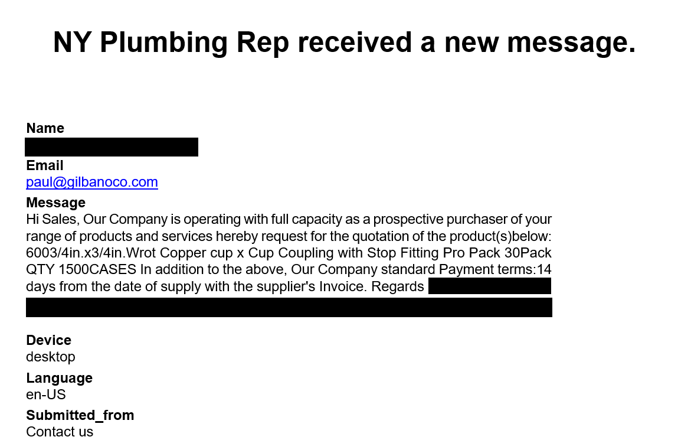
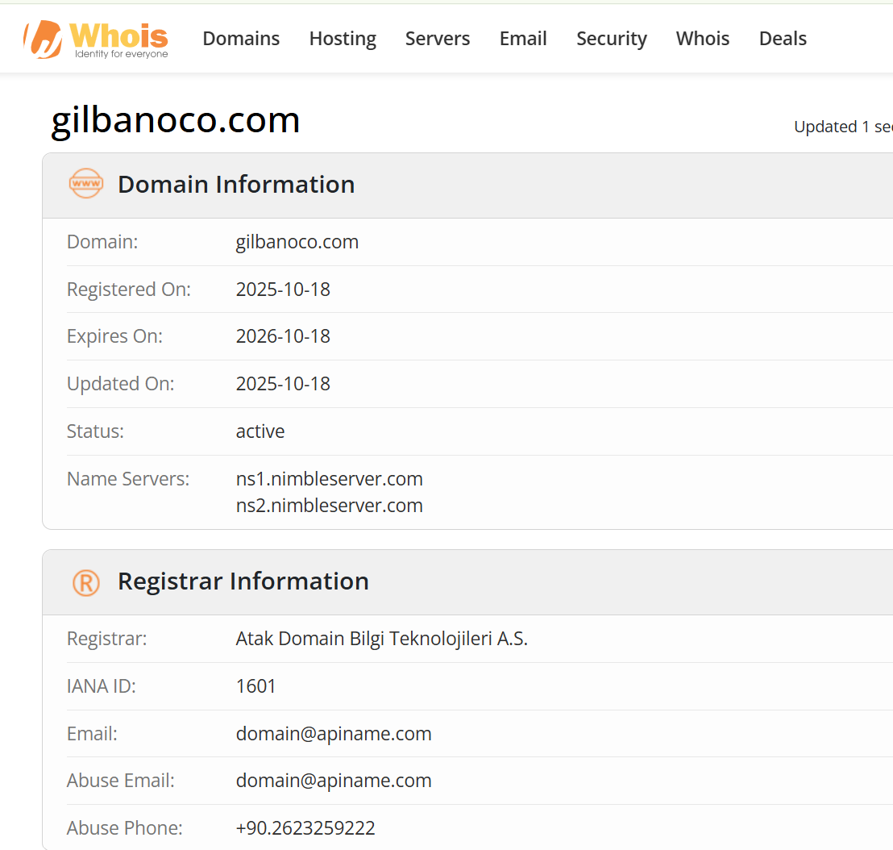
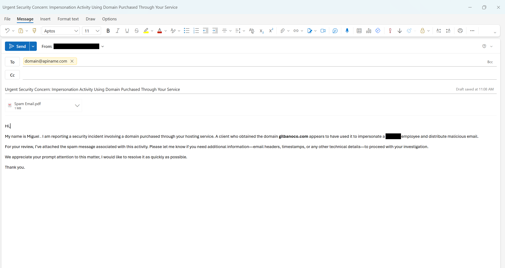
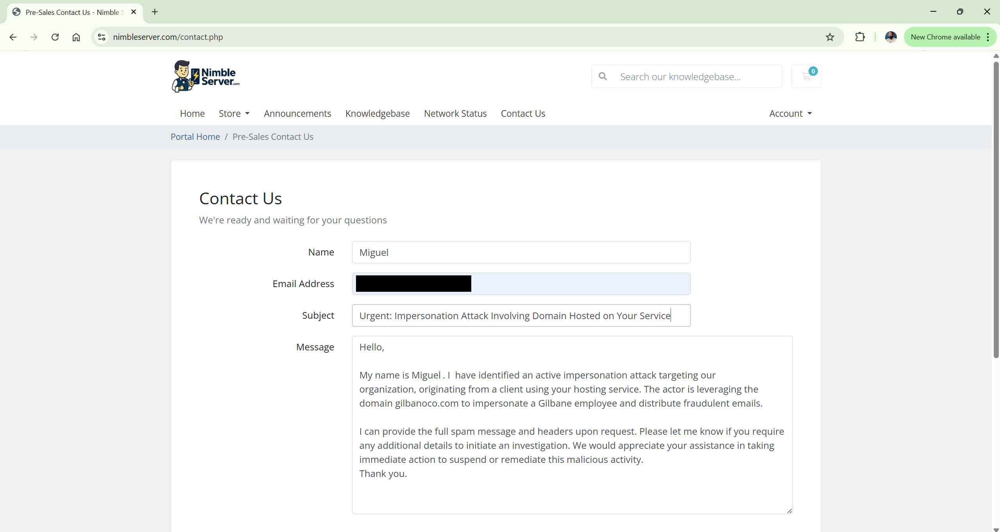

<h1>Hello, I'm Miguel 👋</h1>

<strong>Cybersecurity Analyst | Incident Response | Threat Intelligence</strong>

<h1>🛡️ Executive Impersonation (Whaling) Attack – Incident Response Case Study</h1>

<h2>📌 Overview</h2>

This case study is based on a <strong>real-world phishing incident handled in a production environment</strong>, 
involving a targeted <strong>executive impersonation (whaling) attack</strong>.

A threat actor used a <strong>malicious lookalike domain</strong> to impersonate an executive and attempt to deceive recipients.
This engagement involved <strong>investigation, validation, and active incident response</strong>.

<h2>🚨 Incident Summary</h2>
<ul>
<li>A phishing email was identified impersonating a company executive</li>
<li>The message originated from a <strong>spoofed lookalike domain</strong></li>
<li>The attacker attempted to gain trust using social engineering</li>
</ul>

<h2>🔍 Investigation & Analysis</h2>

<h3>1. Email Analysis</h3>
<ul>
<li>Reviewed sender details and identified domain inconsistencies</li>
<li>Confirmed the domain was not associated with the legitimate organization</li>
</ul>

<h3>2. Domain Intelligence (WHOIS)</h3>
<ul>
<li>Conducted a WHOIS lookup on the malicious domain</li>
<li>Identified:</li>
<ul>
<li>Domain registrar</li>
<li>Hosting provider</li>
<li>Name servers</li>
</ul>

<h3>3. Threat Validation</h3>
<ul>
<li>Determined the domain was malicious based on impersonation indicators</li>
<li>Observed characteristics consistent with phishing infrastructure</li>
</ul>

<h2>🛠️ Active Response Actions</h2>
<ul>
<li>Initiated response after confirming malicious activity</li>
<li>Escalated findings internally</li>
<li>Reported the domain to:
    <ul>
        <li>Hosting provider</li>
        <li>Domain registrar</li>
    </ul>
</li>
<li>Submitted abuse reports with supporting evidence</li>
<li>Assisted in mitigation efforts targeting the malicious domain</li>
</ul>

<h2>📸 Evidence & Artifacts (Sanitized)</h2>

<h3>📧 Malicious Email</h3>

<h3>🌐 WHOIS Lookup</h3>

<h3>📨 Abuse Report – Domain Provider</h3>

<h3>📨 Abuse Report – Hosting Provider</h3>

<h2>🧩 Skills Demonstrated</h2>
<ul>
<li>Incident Response (Production Environment)</li>
<li>Phishing & Social Engineering Analysis</li>
<li>Threat Intelligence & OSINT</li>
<li>Domain & Infrastructure Investigation</li>
</ul>

<h2>🧠 Key Takeaways</h2>
<ul>
<li>Executive impersonation attacks exploit <strong>trust and urgency</strong></li>
<li>Lookalike domains are a common phishing technique</li>
<li>Fast investigation and escalation reduce risk exposure</li>
<li>External reporting helps disrupt attacker infrastructure</li>
</ul>

<h2>🔒 Prevention Strategies</h2>
<ul>
<li>Enforce <strong>SPF, DKIM, DMARC</strong></li>
<li>Monitor for lookalike domains</li>
<li>Conduct phishing awareness training</li>
<li>Implement email security controls</li>
</ul>

<h2>🧬 MITRE ATT&CK Mapping</h2>
<ul>
<li>T1566.002 – Phishing: Spearphishing Link</li>
<li>T1583.001 – Acquire Infrastructure: Domains</li>
<li>T1598 – Phishing for Information</li>
</ul>

<h2>⚠️ Disclaimer</h2>

All information has been <strong>sanitized and generalized</strong> to remove sensitive details.
This case study is for educational and professional demonstration purposes only.

